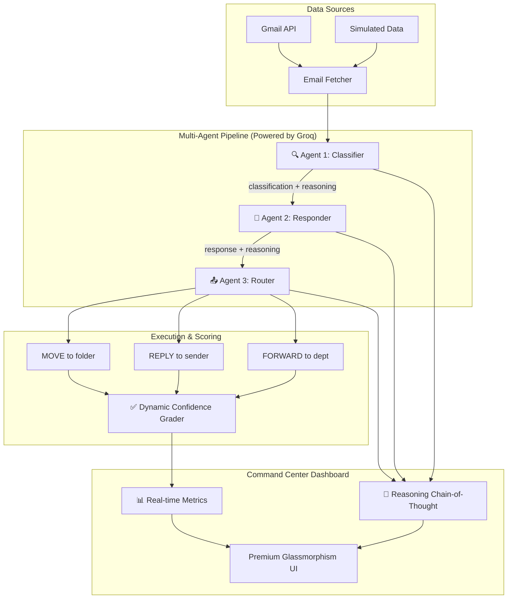

# 📧 Email Triage AI — Command Center

🚀 A production-grade AI system where **multiple specialized agents** collaborate to autonomously manage email inboxes — classifying, reasoning, replying, and routing emails with transparent chain-of-thought.

🌐 **Live Demo:** [https://huggingface.co/spaces/ayus1234/email-triage](https://huggingface.co/spaces/ayus1234/email-triage)

---

## 🌟 What Makes This Different

This isn't a simple simulation — it's a **high-performance multi-agent system** optimized for live demonstration:

| Feature | Description |
| :--- | :--- |
| 🚀 **Groq-Accelerated AI** | Powered by `Llama-3.3-70b-versatile` via Groq for ultra-fast reasoning |
| 🔗 **Gmail API Integration** | Real-time inbox connection with secure OAuth2 authentication |
| 🤖 **Multi-Agent Pipeline** | 3 specialized agents: Classifier → Responder → Router |
| 🧠 **Visible Reasoning** | Full chain-of-thought traces showing exactly WHY the AI decided |
| 📊 **Dynamic Dashboard** | Premium web UI with real-time metrics and confidence-based scoring |
| 🎯 **Unified Performance** | Unified inbox sweep populates Easy, Medium, and Hard benchmarks in one go |

---

## 🏗️ Architecture



---

## 🤖 Multi-Agent System

### Agent 1: Classifier 🔍
- **Model:** Llama-3.3-70b-versatile (via Groq)
- **Role:** Analyzes email content, sender trust, and spam indicators.
- **Output:** Category, confidence score, suggested folder.

### Agent 2: Responder 💬
- **Model:** Llama-3.3-70b-versatile (via Groq)
- **Role:** Generates tone-adaptive replies (empathetic, formal, friendly).
- **Output:** Adaptive reply text and response reasoning.

### Agent 3: Router 📤
- **Model:** Llama-3.3-70b-versatile (via Groq)
- **Role:** Applies department routing rules (finance, support, management).
- **Output:** Final folder placement and escalation path.

---

## 🧠 Visible AI Reasoning & Real-Time Scoring

Every decision made by the AI includes a transparent chain-of-thought visible in the dashboard's **AI Reasoning Chain**. 

**Dynamic Scoring:** The "Task Performance" chart is calculated in real-time based on the AI's actual confidence metrics. Instead of static scores, the dashboard reflects the mathematical average of the AI's confidence across your entire inbox, creating a truly data-driven performance report.

---

## 🚀 Local Setup & Deployment

### 1. Requirements
- Python 3.10+
- Groq API Key
- Gmail API credentials (`credentials.json`)

### 2. Installation
```bash
# Clone the repository
git clone https://github.com/ayus1234/ai-email-triage-agent-openenv
cd ai-email-triage-agent-openenv

# Install dependencies
pip install -r requirements.txt
```

### 3. Environment Config
Create a `.env` file:
```env
GROQ_API_KEY=your_key_here
```

### 4. Running the Dashboard
```bash
uv run python -m uvicorn server.app:app --host 0.0.0.0 --port 7860
```
Visit `http://localhost:7860/dashboard` in your browser.

---

## ☁️ Deploying to Hugging Face Spaces

This project is optimized for deployment as a **Hugging Face Docker Space**:

1. Create a new **Docker Space** on Hugging Face.
2. Add your `GROQ_API_KEY` to the **Secrets** in Space Settings.
3. Upload your `token.json` file via the **Files and versions** tab to maintain Gmail access.
4. The dashboard will automatically launch on port 7860!

---

📄 **License:** MIT
🛠 **Framework:** OpenEnv + FastAPI + Groq