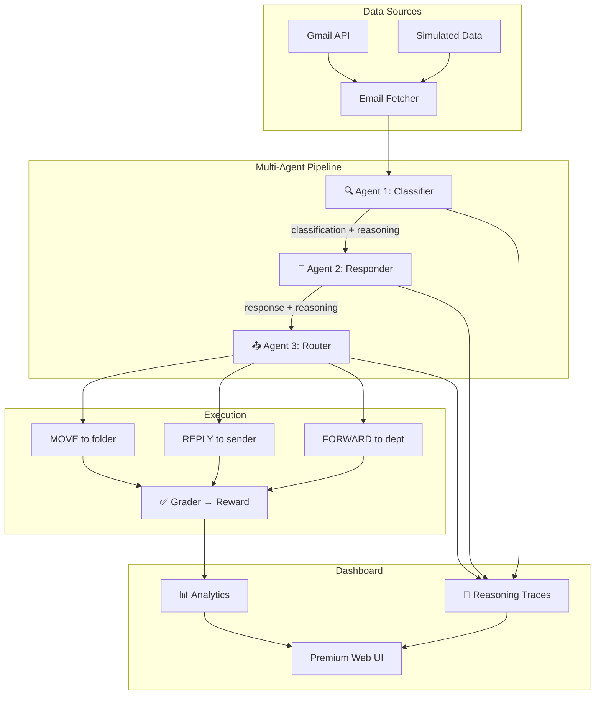

# 📧 Email Triage AI — Multi-Agent System

🚀 A production-grade AI system where **multiple specialized agents** collaborate to autonomously manage email inboxes — classifying, reasoning, replying, and routing emails with transparent chain-of-thought.

🌐 **Live Demo:** [https://huggingface.co/spaces/ayus1234/email-triage](https://huggingface.co/spaces/ayus1234/email-triage)

---

## 🌟 What Makes This Different

This isn't a simple simulation — it's a **production-capable multi-agent system** with:

| Feature | Description |
| :--- | :--- |
| 🔗 **Gmail API Integration** | Real inbox connection with OAuth2 (simulated fallback) |
| 🤖 **Multi-Agent Pipeline** | 3 specialized agents: Classifier → Responder → Router |
| 🧠 **Visible AI Reasoning** | Full chain-of-thought traces showing WHY the AI decided |
| 📊 **Analytics Dashboard** | Real-time metrics, charts, and performance tracking |
| 🎯 **Smart Prompt Engineering** | Few-shot examples, structured JSON output, confidence scoring |

---

## 🏗️ Architecture



---

## 🤖 Multi-Agent System

### Agent 1: Classifier 🔍
- Analyzes email content, sender trust, and spam indicators
- Outputs: category, confidence score, suggested folder
- Few-shot prompted with structured JSON reasoning

### Agent 2: Responder 💬
- Receives classification context from Agent 1
- Generates tone-adaptive replies (empathetic, formal, friendly)
- Template fallback when LLM is unavailable

### Agent 3: Router 📤
- Receives outputs from both previous agents
- Applies department routing rules (finance, support, management)
- Decides folder placement and forwarding

### Pipeline Orchestrator
- Sequential processing with shared context
- Full reasoning trace capture per agent
- Automatic fallback to rule-based decisions

---

## 🧠 Visible AI Reasoning

Every decision shows transparent chain-of-thought:

```json
{
  "agent": "Classifier",
  "reasoning": {
    "content_analysis": "Customer requesting refund for damaged product",
    "sender_trust": "trusted",
    "spam_indicators": [],
    "intent": "requesting financial resolution",
    "urgency": "high",
    "sentiment": "frustrated"
  },
  "classification": {
    "category": "support",
    "confidence": 0.95,
    "suggested_folder": "INBOX"
  }
}
```

---

## 📊 Analytics Dashboard

Access at `/dashboard` — features:
- **Real-time metrics**: Emails processed, spam blocked, replies sent
- **Classification distribution**: Doughnut chart of email categories
- **Task performance**: Bar chart of scores across difficulty levels
- **Agent pipeline visualization**: Animated flow diagram
- **Reasoning feed**: Live chain-of-thought from all agents

---

## 🔗 Gmail API Integration

The system supports **real Gmail inbox connection**:

```bash
# Install Gmail dependencies
pip install google-api-python-client google-auth-httplib2 google-auth-oauthlib

# Set credentials path
export GMAIL_CREDENTIALS_PATH=credentials.json
```

When credentials are not available, the system automatically falls back to enhanced simulated emails.

---

## ⚙️ Environment Design

### 📥 Observation Space (`EmailObservation`)
- `system_message` → Feedback from last action
- `inbox_summary` → List of emails (id, sender, subject, folder)
- `read_email_content` → Full email content
- `done` → Task completion flag
- `reward` → Current evaluation score

### 🎯 Action Space (`EmailAction`)
- `READ` → Open an email
- `MOVE` → Move email to folder
- `REPLY` → Respond to sender
- `FORWARD` → Send to another address
- `SUBMIT` → Trigger final evaluation

### 🧩 Task Design (Progressive Difficulty)
- 🟢 **Easy** — Spam Filtering
- 🟡 **Medium** — Customer Support + Classification
- 🔴 **Hard** — Multi-step: Filter + Respond + Forward

---

## 🎯 Reward System
- Scores range between **0 and 1**
- Final score assigned only on `SUBMIT`
- Evaluation: correct classification + accurate responses + proper routing

---

## 🛠️ Setup & Run

```bash
# Build environment
docker build -t email_triage-env:latest server/

# Validate OpenEnv setup
openenv validate

# Run multi-agent inference
python inference.py

# Access dashboard
open http://localhost:7860/dashboard
```

---

## 📁 Project Structure

```
my_env/
├── agents/                    # Multi-agent system
│   ├── classifier.py          # Agent 1: Email classification
│   ├── responder.py           # Agent 2: Reply generation
│   ├── router.py              # Agent 3: Email routing
│   └── pipeline.py            # Orchestrator
├── prompts/                   # Prompt engineering
│   ├── classifier_prompt.py   # Few-shot classification prompts
│   ├── responder_prompt.py    # Tone-adaptive response prompts
│   └── router_prompt.py       # Department routing prompts
├── server/                    # FastAPI server
│   ├── app.py                 # Server entry point
│   ├── dashboard.py           # Dashboard API routes
│   ├── dashboard.html         # Premium analytics UI
│   └── my_env_environment.py  # OpenEnv environment
├── gmail_client.py            # Gmail API integration
├── reasoning_engine.py        # Chain-of-thought collector
├── analytics_store.py         # In-memory metrics
├── inference.py               # Multi-agent inference engine
├── models.py                  # Data models
├── client.py                  # OpenEnv client
└── Dockerfile                 # Container deployment
```

---

## 🔥 Key Highlights
- 🤖 **Multi-Agent Architecture** — 3 specialized collaborative agents
- 🧠 **Transparent Reasoning** — Full chain-of-thought for every decision
- 🔗 **Real-World Integration** — Gmail API with graceful fallback
- 📊 **Production Dashboard** — Real-time analytics and visualization
- 🎯 **Smart Prompts** — Few-shot examples with structured JSON output
- ⚙️ **Robust Rewards** — Multi-criteria grading system
- 🚀 **Scalable Design** — Docker + HuggingFace Spaces ready

---

## 👥 Team OpenAgents

Built for **Meta PyTorch Hackathon x Scaler School of Technology** 🚀

**Contributors:**
- **Ayush Nathani** – Lead & Core Implementation
- **Amrit Sugandh** – Team Member
- **Rajababu Kumar** – Team Member

---

## 🏁 Final Note

This project demonstrates how **multi-agent AI systems** can move beyond simple Q&A to execute real-world workflows autonomously — with full transparency, real integrations, and production-grade engineering.

👉 **From understanding intent → collaborative reasoning → taking action → completing tasks — this is a step toward truly agentic AI systems.**