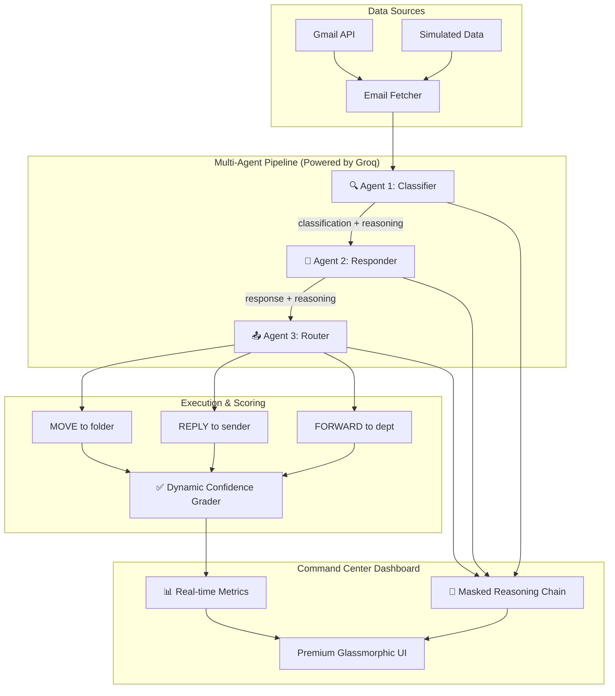

# 📧 Email Triage AI — Command Center

🚀 A production-grade AI system where **multiple specialized agents** collaborate to autonomously manage email inboxes — classifying, reasoning, replying, and routing emails with transparent chain-of-thought.

🌐 **Live Demo:** [https://huggingface.co/spaces/ayus1234/email-triage](https://huggingface.co/spaces/ayus1234/email-triage)

---

## 🌟 What Makes This Different

This isn't a simple simulation — it's a **high-performance multi-agent system** optimized for live production environments:

| Feature | Description |
| :--- | :--- |
| ⚡ **Llama-3.3-70b-versatile** | Powered by Groq's model for high-speed multi-agent reasoning |
| 🛡️ **Auto-Privacy Masking** | Real-time redaction of email addresses and sensitive data in reasoning traces |
| 🔗 **Gmail API Integration** | Production-ready OAuth2 connection with helper script (`authenticate_gmail.py`) |
| 🤖 **Multi-Agent Pipeline** | 3 specialized agents: Classifier → Responder → Router |
| 🧠 **Visible Reasoning** | Full chain-of-thought traces showing exactly WHY the AI decided |
| 📊 **Dynamic Dashboard** | Premium web UI with real-time metrics and confidence-based scoring |

---

## 🏗️ Architecture


```mermaid
graph TD
    subgraph "Data Sources"
        G["Gmail API"] --> F["Email Fetcher"]
        S["Simulated Data"] --> F
    end
    
    subgraph "Multi-Agent Pipeline (Powered by Groq)"
        F --> A1["🔍 Agent 1: Classifier"]
        A1 -->|"classification + reasoning"| A2["💬 Agent 2: Responder"]
        A2 -->|"response + reasoning"| A3["📤 Agent 3: Router"]
    end
    
    subgraph "Execution & Scoring"
        A3 --> E1["MOVE to folder"]
        A3 --> E2["REPLY to sender"]
        A3 --> E3["FORWARD to dept"]
        E1 & E2 & E3 --> GR["✅ Dynamic Confidence Grader"]
    end
    
    subgraph "Command Center Dashboard"
        GR --> D1["📊 Real-time Metrics"]
        A1 & A2 & A3 --> D2["🧠 Masked Reasoning Chain"]
        D1 & D2 --> UI["Premium Glassmorphic UI"]
    end
```

---

## 🤖 Multi-Agent System

### Agent 1: Classifier 🔍
- **Model:** Llama-3.3-70b-versatile (via Groq)
- **Role:** Analyzes email content, sender trust, and spam indicators.
- **Output:** Category, confidence score, suggested folder.

### Agent 2: Responder 💬
- **Model:** Llama-3.3-70b-versatile (via Groq)
- **Role:** Generates tone-adaptive replies (empathetic, formal, friendly).
- **Output:** Adaptive reply text and response reasoning.

### Agent 3: Router 📤
- **Model:** Llama-3.3-70b-versatile (via Groq)
- **Role:** Applies department routing rules (finance, support, management).
- **Output:** Final folder placement and escalation path.

---

## 🛡️ Enterprise-Grade Privacy

To ensure safe live demonstrations, the system includes an **Automatic Privacy Masking** engine. Every piece of data processed from the Gmail API is passed through a redaction layer before reaching the dashboard:
- **Email Addresses:** `user@example.com` → `u***@e***.com`
- **Sensitive Mentions:** Automatic detection and masking in reasoning logs.
- **Reasoning Traces:** Full transparency without identity leakage.

---

## 🚀 Local Setup & Deployment

### 1. Requirements
- Python 3.10+
- Groq API Key
- Gmail API credentials (`credentials.json`)

### 2. Installation
```bash
# Clone the repository
git clone https://github.com/ayus1234/ai-email-triage-agent-openenv
cd ai-email-triage-agent-openenv

# Install dependencies
pip install -r requirements.txt
```

### 3. Gmail Re-Authentication (Optional for Real Gmail)
Run the local OAuth helper script to generate `token.json` and get the `GMAIL_TOKEN_DATA` secret for deployment:
```bash
python authenticate_gmail.py
```

### 4. Environment Config
Create a `.env` file:
```env
GROQ_API_KEY=your_key_here
MODEL_NAME=llama-3.3-70b-versatile
```

### 5. Running the Dashboard
```bash
uv run python -m uvicorn server.app:app --host 0.0.0.0 --port 7860
```
Visit `http://localhost:7860/dashboard` in your browser.

---

## ☁️ Deploying to Hugging Face Spaces

This project is optimized for deployment as a **Hugging Face Docker Space**:

1. Create a new **Docker Space** on Hugging Face.
2. Add your `GROQ_API_KEY` to the **Secrets** in Space Settings.
3. Run `python authenticate_gmail.py` locally and paste the output string into secret `GMAIL_TOKEN_DATA`.
4. Set variable `MODEL_NAME` to `llama-3.3-70b-versatile` under Space Variables.
5. The dashboard will automatically launch on port 7860!

---

📄 **License:** MIT
🛠 **Framework:** OpenEnv + FastAPI + Groq